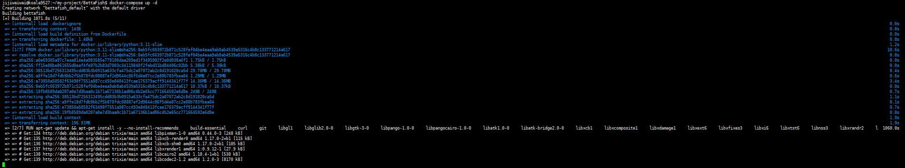

# 前言
自己一直都在逛linux do 这个论坛，看到很多有大佬，特别是很年轻的大佬，很是敬佩
我看到了一个项目竟然是一个大学生做的，利用网络工具收集信息再用AI舆情分析的的工具，并且利用这个开源项目带来了一个实习机会还有不错的薪资水平
借用作者的一句话：整体复盘下来，当下是个人开发者和独立产品经理的好时代。只要能找到具体的行业场景与真实痛点，哪怕是细分领域，也能做出亮眼的成果。与其追逐那些已经被大厂卷到极致的通用 AI落地场景，不如在小而深的领域扎根，让技术真正解决问题。窗口期还在，关键是敢于开始。

作者在 自己的公众号提出 ：“在我的刻板印象中，舆情分析这种大多都是企业级的高价值产品，很少见到如此完善的开源实现”, linux do论坛热评也是这样，的确做的特别完善 的舆情分析没有见过，今天就来验证一下究竟能做到什么样的程度

# 开始
克隆项目：
https://github.com/666ghj/BettaFish

配置项目的配置文件：
```
# -*- coding: utf-8 -*-
"""
微舆配置文件
"""

# ============================== 数据库配置 ==============================
# 配置这些值以连接到您的MySQL实例。
DB_HOST = "127.0.0.1"  # 例如："localhost" 或 "127.0.0.1"
DB_PORT = 3306
DB_USER = "root"
DB_PASSWORD = "jijiwaiwai123"
DB_NAME = "your_db_name"
DB_CHARSET = "utf8mb4"
# 我们也提供云数据库资源便捷配置，日均10w+数据，可免费申请，联系我们：670939375@qq.com
# NOTE：为进行数据合规性审查与服务升级，云数据库自2025年10月1日起暂停接收新的使用申请


# ============================== LLM配置 ==============================
# 您可以更改每个部分LLM使用的API，🚩只要兼容OpenAI请求格式都可以，定义好KEY、BASE_URL与MODEL_NAME即可正常使用。
# 重要提醒：我们强烈推荐您先使用推荐的配置申请API，先跑通再进行您的更改！

# Insight Agent（推荐Kimi，申请地址：https://platform.moonshot.cn/）
INSIGHT_ENGINE_API_KEY = "sk-uREz86JMEgAljcEduWX1Zz7LXbf7POEV5lJScATdqacGUgwH"
INSIGHT_ENGINE_BASE_URL = "https://api.moonshot.cn/v1"
INSIGHT_ENGINE_MODEL_NAME = "kimi-k2-0711-preview"

# Media Agent（推荐Gemini，这里我用了一个中转厂商，你也可以换成你自己的，申请地址：https://www.chataiapi.com/）
MEDIA_ENGINE_API_KEY = "sk-2W7ossYyvOu90nM5r5GcSybm2grfd1c02Nh5rdA3PJ7ilqtv"
MEDIA_ENGINE_BASE_URL = "https://www.chataiapi.com/v1"
MEDIA_ENGINE_MODEL_NAME = "gemini-2.5-pro"

# Query Agent（推荐DeepSeek，申请地址：https://www.deepseek.com/）
QUERY_ENGINE_API_KEY = "sk-4e4d185006fd40a0ac5dd0d4252302ff"
QUERY_ENGINE_BASE_URL = "https://api.deepseek.com"
QUERY_ENGINE_MODEL_NAME = "deepseek-reasoner"

# Report Agent（推荐Gemini，这里我用了一个中转厂商，你也可以换成你自己的，申请地址：https://www.chataiapi.com/）
REPORT_ENGINE_API_KEY = "sk-2W7ossYyvOu90nM5r5GcSybm2grfd1c02Nh5rdA3PJ7ilqtv"
REPORT_ENGINE_BASE_URL = "https://www.chataiapi.com/v1"
REPORT_ENGINE_MODEL_NAME = "gemini-2.5-pro"

# Forum Host（Qwen3最新模型，这里我使用了硅基流动这个平台，申请地址：https://cloud.siliconflow.cn/）
FORUM_HOST_API_KEY = "sk-qjctvvkbtewuwvstptrmdfyazpzlsbrvwtffzxkejslzzkyd"
FORUM_HOST_BASE_URL = "https://api.siliconflow.cn/v1"
FORUM_HOST_MODEL_NAME = "Qwen/Qwen3-235B-A22B-Instruct-2507"

# SQL keyword Optimizer（小参数Qwen3模型，这里我使用了硅基流动这个平台，申请地址：https://cloud.siliconflow.cn/）
KEYWORD_OPTIMIZER_API_KEY = "sk-qjctvvkbtewuwvstptrmdfyazpzlsbrvwtffzxkejslzzkyd"
KEYWORD_OPTIMIZER_BASE_URL = "https://api.siliconflow.cn/v1"
KEYWORD_OPTIMIZER_MODEL_NAME = "Qwen/Qwen3-30B-A3B-Instruct-2507"


# ============================== 网络工具配置 ==============================
# Tavily API（申请地址：https://www.tavily.com/）
TAVILY_API_KEY = "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"

# Bocha API（申请地址：https://open.bochaai.com/）
BOCHA_WEB_SEARCH_API_KEY = "sk-9e0057500b7c4ff8af77767dffe0a5dc"
```

## 数据库配置
自己是机器本地部署的mysql ，host直接使用 127.0.0.1 ,需要提前创建对应的数据据库，设置对应的数据库名称

## LLM配置
先按照项目推荐的配置跑通
注册了https://www.chataiapi.com/ 中转 
Tavily API   就是一个帮 AI 模型快速从网页上“查资料、抓内容、提取干净信息”的服务，让你的程序像有个聪明助手一样能上网找答案。
Bocha API（也叫 Bocha Search API）是一个专为 AI 应用设计的网络搜索服务


启动测试
docker-compose up -d


网络原因启动花了很久下载项目
