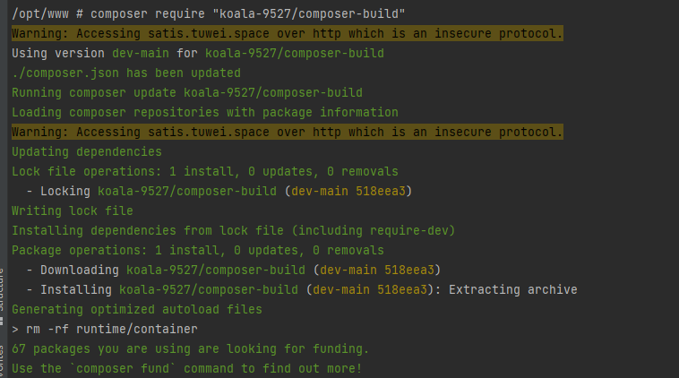

composer相当于PHP 包管理器,在日常工作中有很多可以服用的代码都可以使用composer 来制作私有composer包来进行分发，同统一管理，特别是在公司内部一些新项目初始化需要使用一些公共的方法就不需要重复复制了，可以减少很多心智负担，使用composer命令就能下载项目的依赖包。

# 前提
安装composer    
 

安装Git  


公网IP机器，域名解析，Docker

# 制作composer包
先找到一个空目录，执行composer 初始化命令：
```
composer init 
```

然后出现一连串的询问：
* 1.This command will guide you through creating your composer.json config.`
Package name (<vendor>/<name>) :

  填写自己的包名,我填写的是：koala9527/composer-build

* 2.Description []:

  需要填写这个包的描述信息，我填写的是：just test

* 3.Author [**** <koala9217@qq.com>, n to skip]:

  提示填写作者信息，可以直接跳过输入n

* 4.Minimum Stability []:

  提示填写最小稳定版本，可输入内容为：stable, RC, beta, alpha, dev，稳定性依次从左到右从大到小，越左边越稳定bug越少，自己测试的包就输入：dev

* 5.Package Type (e.g. library, project, metapackage, composer-plugin)[]: library

  提示填写项目类型

  > library: 这是默认类型，它会简单地将文件复制到 vendor 目录。
project: 这表示当前包是一个项目，而不是一个库。
metapackage: 当一个空的包，包含依赖并且需要触发依赖的安装，这将不会对系统写入额外的文件。因此这种安装类型并不需要一个 dist 或 source。
composer-plugin: 一个安装类型为 composer-plugin 的包，它有一个自定义安装类型，可以为其它包提供一个 installler。详细请查看 自定义安装类型。
>
  这里就是填的默认类型

* 6.License[]:
提示填写开源许可证
参考下图：


  填写一个最宽松的`MIT`许可

* 7.Would you like to define your dependencies (require) interactively [yes]？

  提示是否需要设置依赖环境或者其他包，输入yes

* 8.Search for a package：

  提示搜索哪个依赖?依赖PHP,输入php

* 9.Enter the version constraint to require (or leave blank to use the latest version)：

  需要哪个版本？注意最好是精确输入自己电脑环境一样的PHP版本，我这里是7.4.30，不然会出现以下报错：


* 10.重复询问7和8的问题，直接回车跳过

* 11.Add PSR-4 autoload mapping? laps namespace "Koala9527\Composerbuild"to the entered       relative path. [src/, n to skip]:

  是否添加PSR-4自动加载映射，将命名空间 “Koala9527\Composerbuild “映射到输入的相对路径， 这里输入了n 跳过，在后面composer.json自己增加autolaod的配置

  接下来就会预览这个composer包composer.json的预览内容,下面会再次询问是否确认生成

* 11.Do you confirm generation[yes]?
 
   确认生成 yes

* 12. Would you like to install dependencies now [yes]?

  是否先择安装依赖，输入yes ,没有其他依赖会直接完成


最后整个过程截图：


生成的文件目录结构：

```
  |-- composer-build',
      |-- composer.json',
      |-- composer.lock',
      |-- package-lock.json',
      |-- vendor',
          |-- autoload.php',
          |-- composer',
              |-- autoload_classmap.php',
              |-- autoload_namespaces.php',
              |-- autoload_psr4.php',
              |-- autoload_real.php',
              |-- autoload_static.php',
              |-- ClassLoader.php',
              |-- installed.json',
              |-- installed.php',
              |-- InstalledVersions.php',
              |-- LICENSE',
              |-- platform_check.php',
  
```
此时这个composer包没有任何内容，我们需要给他添加一个测试的功能代码

新建功能代码之前需要在composer.json添加pst-4自动加载配置，在项目根目录composer.json添加以下代码：
```
"autoload": {
    "psr-4": {
        "Test\\": "src/"
    }
}
```
然后在项目根目录新建src 目录，在src目录下Test.php文件，文件内容为：
```
<?php

namespace Test;


class Test

{

    public function index()

    {

        echo 'composer包测试成功';
    }
}

```

然后执行` composer dump-autoload`命令 自动加载类映射 生成配置，具体配置内容在vendor/composer/autoload_psr4.php 文件中

最后在根目录下新建一个index.php文件测试，内容为：
```
<?php
require "vendor/autoload.php";
use Test\Test;
$Test = new Test();
$Test->index();
```
使用PHP 命令运行这个index.php 文件：


测试成功！

# 上传GitHub
项目需要公开，首先新建一个Git仓库


把刚刚制作的composer 项目全部代码上传

 

依次执行以下Git命令就上传成功了

```
git init
git add .
git commit -m 'first commit'
git branch -M main
git remote add origin git@github.com:koala9527/composer-test.git
git push -u origin main
```

# 搭建satis仓库

satis是Composer 官方提供的建立私有源的工具，比较简单，原理就是把Git仓库里的composer 包拉取下来制作成静态文件，然后需要自己通过Nginx镜像容器部署形成一个简单的UI界面，进行composer包的分发下载的服务

这里只做一个最简单的尝试，没有权限验证的配置

首先是需要一个公网的机器

选定一个空白文件夹新建一个satis.json配置文件。内容如下(/home/satis/build/satis.json)：
```
{
    "name": "koala/composer-test",
    "homepage": "http://satis.tuwei.space",
    "repositories": [
        {"type": "vcs", "url": "https://github.com/koala9527/composer-test" }
    ],
    "require-all": true
}
```
注意：

1. json配置文件中name字段必须是在composer包创建时的vendor/package的内容，否则无法初始化

2. homepage 是satis仓库的访问域名地址，也就是自己私有源的地址

3. repositories就是配置自己的GitHub项目地址，这里可以配置成一个列表，包含多个composer包。vcs的意思是版本控制系统

4. require-all 拉取全部包


使用composer/satis 镜像拉取GitHub内容打包静态文件和UI界面：

```
docker run --rm -it -v /home/satis/build:/build  -v /home/satis/composer:/composer  composer/satis
```

主要参数是`--rm` ，容器只运行一次，退出时删除。

在宿主机/home/satis/build目录下会生成output 文件夹，此时把这个文件通过Nginx容器运行起来，然后通过域名解析，satis私有仓库就搭建完成了


通过Nginx镜像运行静态UI界面
```
docker run -itd --name=nginx_satis -p 8881:80 -v /home/satis/build/output:/usr/share/nginx/html nginx
```

域名解析到宿主机8881端口，这里通过自己服务中的宝塔反向代理解析，现在访问域名：

**satis.tuwei.space**


# 测试

拿一个不重要的项目测试，项目根目录下composer.json文件添加私有源配置：
```
"repositories": [
    {
        "type": "composer",
        "url": "http://satis.tuwei.space"
    }
]
```
还可以更换全局的composer 源来拉取这个私有composer包：
```
composer config -g repo.packagist composer http://satis.tuwei.space
```

自己的私有仓库是http协议，需要取消安全检查，不然在composer require 命令会报错：
```
composer config -g secure-http false
```
使用`composer require` 拉取私有包：
```
composer require koala/composer-test
```


# 参考教程
https://hub.docker.com/r/composer/satis  
https://zhuanlan.zhihu.com/p/542952527