## 前言
两年前买了四台树莓派4B 组了一个K8s 集群，在知乎，掘金发了两篇搭建的教程，一直都有人收藏，网上的教程也很少，今年年初看到树莓派溢价非常多，几乎没有做什么应用搭建在上面，就拿过来组集群写些教程使用了，所以索性咸鱼几乎翻倍都出了。
最近看到随身wifi棒子特别的火，又有人搭建利用随身wifi的Docker Swarm集群，自己有想动手弄一个，又在咸鱼淘了四个处理器为RK3568的机器，处理器配置比树莓派配置要好，但是只有4G内存，主要是才90元一个，买了12V DC电源。不到400。


如果对kubernetes基本概念不熟悉，请务必找到之前文章去熟悉一下，之前的文章的细节描述非常仔细清楚~

系统是自带的Armbian:
```shell
root@panther-x2-main:~# uname -a
Linux panther-x2-main 6.1.28-rockchip64 #1 SMP PREEMPT Thu May 11 14:04:52 UTC 2023 aarch64 aarch64 aarch64 GNU/Linux
```
Armbian是轻量级的Debian系统，Linux有两大分支系列，一个是Debian 一个是Redhat。每个系列又有不同的更细的分支。
Redhat是商业公司维护的发行版本，Debian是社区组织维护的发行版本
一般个人折腾用Debian 社区强大，公司的生产环境用Centos。

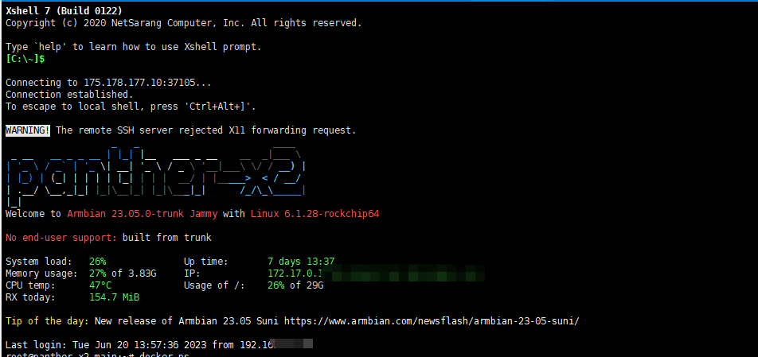

## 开始

### 更改机器主机名称（hostname）
因为系统刷机后系统的名称完全一样，需要修改名称才能分辨他们

一台Master节点 ，3台Work节点， 需要把四台机器的分为改为：
```shell
panther-x2-main
panther-x2-1
panther-x2-2
panther-x2-3
```
每台机器设置分别需要修改"/etc/hostname"文件内容
用Master节点举一个例子：
```shell
vim /etc/hostname
```


改完后的效果：
```shell
root@panther-x2-main:~# cat /etc/hostname
panther-x2-main
root@panther-x2-1:~# cat /etc/hostname
panther-x2-1
root@panther-x2-2:~# cat /etc/hostname
panther-x2-2
root@panther-x2-3:~# cat /etc/hostname
panther-x2-3
```
### 设置静态IP
静态IP的作用就是让机器在内网环境下有一个固定的IP，不能让它每次重启有一个不一样的IP，那样机器之间就无法正常沟通了。

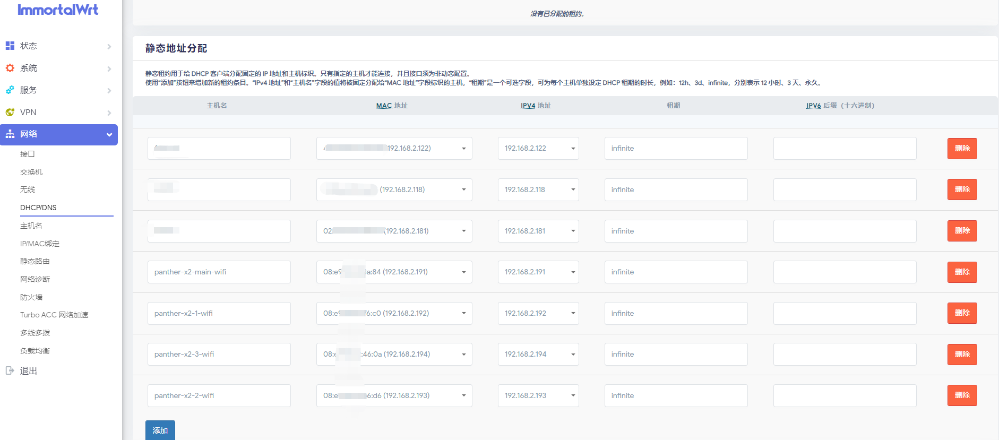
每一台机器都需要执行一样的命令：
```shell
sudo cat >> /etc/hosts << EOF
192.168.2.191 panther-x2-main
192.168.2.192 panther-x2-1
192.168.2.193 panther-x2-2
192.168.2.194 panther-x2-3
EOF
```
### 关闭swap 内存交换空间
关闭它是为了保证Kubernetes集群的稳定性和可靠性，Swap分区是一种虚拟内存技术，当系统内存不足时，会将少用的内存数据交换到硬盘中，以便释放更多的内存空间给正在运行的进程使用。但是，当Swap分区被使用时，它会导致系统的性能下降，因为硬盘速度比内存慢得多。如果Kubernetes节点上的应用程序频繁地使用Swap分区，那么整个集群的性能就会受到影响，因此关闭Swap分区可以避免这种情况的发生

每台机器都要执行
```shell
vim  /etc/default/armbian-zram-config 
```
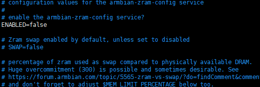

```shell
vim /etc/cron.d/armbian-truncate-logs
```
注释掉第三行


然后注释掉最后一行：
```shell
vim /etc/cron.daily/armbian-ram-logging

```


然后重启，验证swap是否被关闭：


### 关闭SElinux
根据提示没有安装
```shell
root@panther-x2-main:~# dpkg -s selinux-policy-default
dpkg-query: package 'selinux-policy-default' is not installed and no information is available
Use dpkg --info (= dpkg-deb --info) to examine archive files.
```
### 关闭IPv4转发
IPv4 转发通常允许将网络流量从一个网络接口传输到另一个网络接口可能会导致安全漏洞。
```shell
/etc/sysctl.conf
```
默认关闭了：

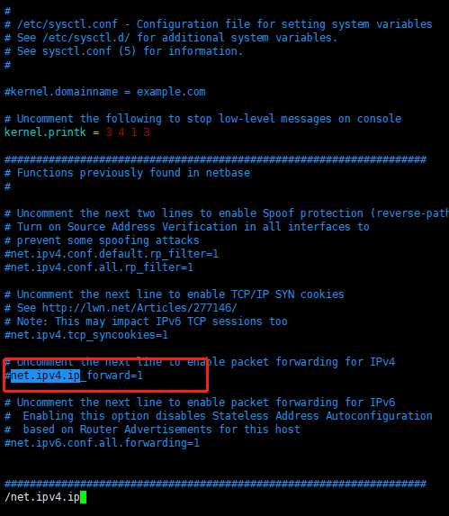

### 安装一些软件
```shell
apt-get update
apt-get install apt-transport-https \
ca-certificates \
curl \
gnupg2  \
software-properties-common
```

```shell
sudo apt-get install docker-ce docker-ce-cli containerd.io
```

### 配置docker
这个非常重要，Kubernetes官方指出在1.24之后删除了dockershim组件，我现在在要安装最新版的kubernetes1.27,默认的运行时是contained，而目前Docker 安装的默认运行时是docker-runc，所以需要切换Docker 的运行时。
偷了懒问了一下chatgpt 如何切换docker运行时，实测很准确

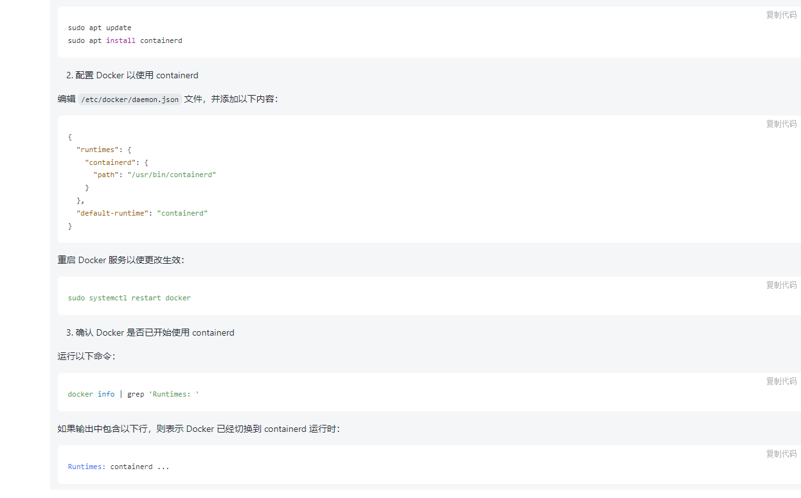

最近因为某些原因Docker好多镜像拉取不下来，需要手动添加一下镜像源，需要如下修改：

```shell
root@panther-x2-main:~# cat /etc/docker/daemon.json 
{
  "exec-opts": ["native.cgroupdriver=systemd"],
 "registry-mirrors": [
         "https://docker.m.daocloud.io",
        "https://dockerproxy.com",
        "https://docker.mirrors.ustc.edu.cn",
        "https://docker.nju.edu.cn"
 ],
 "default-runtime": "containerd",
  "runtimes": {
    "containerd": {
      "path": "/usr/bin/containerd"
    }
  }
}

```
最后验证一下：
```shell
root@panther-x2-main:~# docker info | grep -i runtime
 Runtimes: containerd io.containerd.runc.v2 runc
 Default Runtime: containerd
root@panther-x2-main:~# 
```
### 安装最新版kubelet，kubeadm，kubectl

每个机器都有需要执行以下命令：
更新 apt 包索引并安装使用 Kubernetes apt 仓库所需要的包：
```shell
sudo apt-get update
sudo apt-get install -y apt-transport-https ca-certificates curl
```
下载 Google Cloud 公开签名秘钥：
```shell
curl -fsSL https://packages.cloud.google.com/apt/doc/apt-key.gpg | sudo gpg --dearmor -o /etc/apt/keyrings/kubernetes-archive-keyring.gpg
```
添加 Kubernetes apt 仓库：
```shell
echo "deb [signed-by=/etc/apt/keyrings/kubernetes-archive-keyring.gpg] https://apt.kubernetes.io/ kubernetes-xenial main" | sudo tee /etc/apt/sources.list.d/kubernetes.list
```
安装 kubelet、kubeadm 和 kubectl，之前使用树莓派安装的是1.20版本的，社区已经不支持和维护了，k8s版本迭代的还是很快的，目前是四个月一个小版本，一个月支持版本一个补丁，还是很快的，有很大的学习压力呀，还有关联到了各种的组件的支持
目前最新的版本是1.27，现在来根据官方文档安装：

```shell
sudo apt-get install -y kubelet kubeadm kubectl
sudo apt-mark hold kubelet kubeadm kubectl

```
### 前置设置

根据文档/etc/containerd/config.toml 更改驱动  
containerd config default > /etc/containerd/config.toml

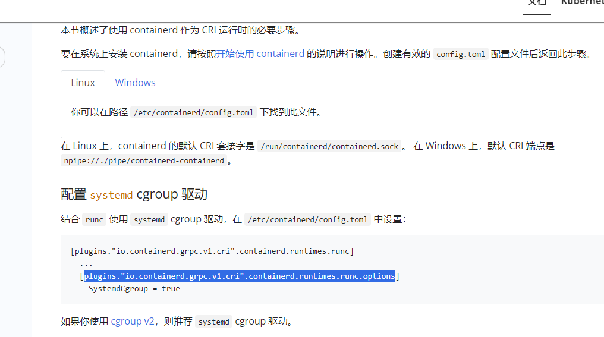


修改：/etc/containerd/config.toml

将SystemdCgroup的值修改为true，将sandbox_image的值修改为国内镜像registry.cn-hangzhou.aliyuncs.com/google_containers/pause:3.8
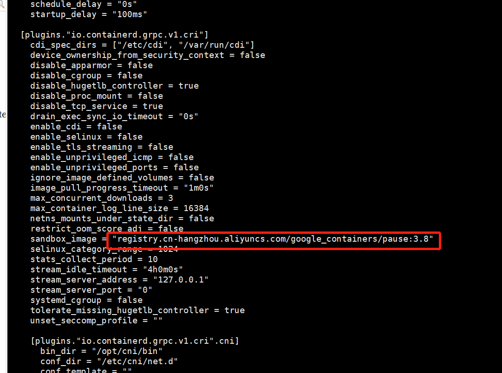


然后重启contained:
```shell
systemctl restart containerd

```

还可以做一下前置检查
```shell
kubeadm init phase preflight
```

### 前置拉取镜像改名字：
由于某些原因直接拉去k8s所需要的镜像是拉取不下来的，只能参照官方的离线安装方案，先把同步到国内源的镜像拉取下来再改tag名称，最好做一个shell脚本，每台机器都需要执行一下拉取镜像，改tag名称：
脚本内容：
```shell
root@panther-x2-main:~# cat pull_k8s_docker.sh 
MY_REGISTRY=registry.aliyuncs.com/google_containers

K8S_VERSION="v1.27.2"
echo ""
echo "=========================================================="
echo "Pull Kubernetes for x64 v$K8S_VERSION Images from docker.io ......"
echo "=========================================================="
echo ""
## 拉取镜像%s/oldWords/newWords//g
docker pull ${MY_REGISTRY}/kube-apiserver:$K8S_VERSION
docker pull ${MY_REGISTRY}/kube-controller-manager:$K8S_VERSION
docker pull ${MY_REGISTRY}/kube-scheduler:$K8S_VERSION
docker pull ${MY_REGISTRY}/kube-proxy:$K8S_VERSION
docker pull ${MY_REGISTRY}/pause:3.8
docker pull ${MY_REGISTRY}/etcd:3.5.7-0
docker pull coredns/coredns:1.10.1

## 添加Tag
docker tag ${MY_REGISTRY}/kube-apiserver:$K8S_VERSION registry.k8s.io/kube-apiserver:$K8S_VERSION
docker tag ${MY_REGISTRY}/kube-scheduler:$K8S_VERSION registry.k8s.io/kube-scheduler:$K8S_VERSION
docker tag ${MY_REGISTRY}/kube-controller-manager:$K8S_VERSION registry.k8s.io/kube-controller-manager:$K8S_VERSION
docker tag ${MY_REGISTRY}/kube-proxy:$K8S_VERSION registry.k8s.io/kube-proxy:$K8S_VERSION
docker tag ${MY_REGISTRY}/pause:3.8 registry.k8s.io/pause:3.8
docker tag ${MY_REGISTRY}/etcd:3.5.7-0 registry.k8s.io/etcd:3.5.7-0
docker tag coredns/coredns:1.10.1 registry.k8s.io/coredns:v1.10.1

```
### 开始安装
在Master 节点执行一下命令：
```shell
sudo kubeadm init --image-repository=registry.aliyuncs.com/google_containers --kubernetes-version=v1.27.2 --apiserver-advertise-address=192.168.2.191 --pod-network-cidr=192.168.0.0/16 --ignore-preflight-errors=all
```
效果如下：
```shell
root@panther-x2-main:~# sudo kubeadm init --image-repository=registry.aliyuncs.com/google_containers --kubernetes-version=v1.27.2 --apiserver-advertise-address=192.168.2.191 --pod-network-cidr=192.168.0.0/16 --ignore-preflight-errors=all
[init] Using Kubernetes version: v1.27.2
[preflight] Running pre-flight checks
[preflight] Pulling images required for setting up a Kubernetes cluster
[preflight] This might take a minute or two, depending on the speed of your internet connection
[preflight] You can also perform this action in beforehand using 'kubeadm config images pull'
W0611 22:16:04.216900    4263 images.go:80] could not find officially supported version of etcd for Kubernetes v1.27.2, falling back to the nearest etcd version (3.5.7-0)
W0611 22:16:04.743772    4263 checks.go:835] detected that the sandbox image "registry.cn-hangzhou.aliyuncs.com/google_containers/pause:3.8" of the container runtime is inconsistent with that used by kubeadm. It is recommended that using "registry.aliyuncs.com/google_containers/pause:3.9" as the CRI sandbox image.
[certs] Using certificateDir folder "/etc/kubernetes/pki"
[certs] Generating "ca" certificate and key
[certs] Generating "apiserver" certificate and key
[certs] apiserver serving cert is signed for DNS names [kubernetes kubernetes.default kubernetes.default.svc kubernetes.default.svc.cluster.local panther-x2-main] and IPs [10.96.0.1 192.168.2.191]
[certs] Generating "apiserver-kubelet-client" certificate and key
[certs] Generating "front-proxy-ca" certificate and key
[certs] Generating "front-proxy-client" certificate and key
[certs] Generating "etcd/ca" certificate and key
[certs] Generating "etcd/server" certificate and key
[certs] etcd/server serving cert is signed for DNS names [localhost panther-x2-main] and IPs [192.168.2.191 127.0.0.1 ::1]
[certs] Generating "etcd/peer" certificate and key
[certs] etcd/peer serving cert is signed for DNS names [localhost panther-x2-main] and IPs [192.168.2.191 127.0.0.1 ::1]
[certs] Generating "etcd/healthcheck-client" certificate and key
[certs] Generating "apiserver-etcd-client" certificate and key
[certs] Generating "sa" key and public key
[kubeconfig] Using kubeconfig folder "/etc/kubernetes"
[kubeconfig] Writing "admin.conf" kubeconfig file
[kubeconfig] Writing "kubelet.conf" kubeconfig file
[kubeconfig] Writing "controller-manager.conf" kubeconfig file
[kubeconfig] Writing "scheduler.conf" kubeconfig file
[kubelet-start] Writing kubelet environment file with flags to file "/var/lib/kubelet/kubeadm-flags.env"
[kubelet-start] Writing kubelet configuration to file "/var/lib/kubelet/config.yaml"
[kubelet-start] Starting the kubelet
[control-plane] Using manifest folder "/etc/kubernetes/manifests"
[control-plane] Creating static Pod manifest for "kube-apiserver"
[control-plane] Creating static Pod manifest for "kube-controller-manager"
[control-plane] Creating static Pod manifest for "kube-scheduler"
[etcd] Creating static Pod manifest for local etcd in "/etc/kubernetes/manifests"
W0611 22:16:26.878081    4263 images.go:80] could not find officially supported version of etcd for Kubernetes v1.27.2, falling back to the nearest etcd version (3.5.7-0)
[wait-control-plane] Waiting for the kubelet to boot up the control plane as static Pods from directory "/etc/kubernetes/manifests". This can take up to 4m0s
[apiclient] All control plane components are healthy after 21.008446 seconds
[upload-config] Storing the configuration used in ConfigMap "kubeadm-config" in the "kube-system" Namespace
[kubelet] Creating a ConfigMap "kubelet-config" in namespace kube-system with the configuration for the kubelets in the cluster
[upload-certs] Skipping phase. Please see --upload-certs
[mark-control-plane] Marking the node panther-x2-main as control-plane by adding the labels: [node-role.kubernetes.io/control-plane node.kubernetes.io/exclude-from-external-load-balancers]
[mark-control-plane] Marking the node panther-x2-main as control-plane by adding the taints [node-role.kubernetes.io/control-plane:NoSchedule]
[bootstrap-token] Using token: fnxxr7.lgu8fvkl1rc0gukc
[bootstrap-token] Configuring bootstrap tokens, cluster-info ConfigMap, RBAC Roles
[bootstrap-token] Configured RBAC rules to allow Node Bootstrap tokens to get nodes
[bootstrap-token] Configured RBAC rules to allow Node Bootstrap tokens to post CSRs in order for nodes to get long term certificate credentials
[bootstrap-token] Configured RBAC rules to allow the csrapprover controller automatically approve CSRs from a Node Bootstrap Token
[bootstrap-token] Configured RBAC rules to allow certificate rotation for all node client certificates in the cluster
[bootstrap-token] Creating the "cluster-info" ConfigMap in the "kube-public" namespace
[kubelet-finalize] Updating "/etc/kubernetes/kubelet.conf" to point to a rotatable kubelet client certificate and key
[addons] Applied essential addon: CoreDNS
[addons] Applied essential addon: kube-proxy

Your Kubernetes control-plane has initialized successfully!

To start using your cluster, you need to run the following as a regular user:

  mkdir -p $HOME/.kube
  sudo cp -i /etc/kubernetes/admin.conf $HOME/.kube/config
  sudo chown $(id -u):$(id -g) $HOME/.kube/config

Alternatively, if you are the root user, you can run:

  export KUBECONFIG=/etc/kubernetes/admin.conf

You should now deploy a pod network to the cluster.
Run "kubectl apply -f [podnetwork].yaml" with one of the options listed at:
  https://kubernetes.io/docs/concepts/cluster-administration/addons/

Then you can join any number of worker nodes by running the following on each as root:

kubeadm join 192.168.2.191:6443 --token fnxxr7.lgu8fvkl1******* \
	--discovery-token-ca-cert-hash sha256:17a1ad0ad3da3cd3d558c7ba9029cd0043c5a4fa53c2********************* 

```

安装成功。已经提示需要再在Work节点使用 ```kubeadm join``` 就行了

```shell
kubeadm join 192.168.2.191:6443 --token fnxxr7.lgu8fvkl1******* \
	--discovery-token-ca-cert-hash sha256:17a1ad0ad3da3cd3d558c7ba9029cd0043c5a4fa53c2********************* 
```
### 安装Pod 网络附加组件
查看node 状态执行之前需要根据上面的提示让当前用户有管理k8s的权限：
```shell
  mkdir -p $HOME/.kube
  sudo cp -i /etc/kubernetes/admin.conf $HOME/.kube/config
  sudo chown $(id -u):$(id -g) $HOME/.kube/config
```

然后使用`kubectl get nodes` 查看每个node的状态，目前是notready的状态，需要安装网络覆盖组件

首先，在您的集群上安装 Operator
```shell
kubectl create -f https://raw.githubusercontent.com/projectcalico/calico/v3.26.0/manifests/tigera-operator.yaml
```
下载配置 Calico 所需的自定义资源
```shell
curl https://raw.githubusercontent.com/projectcalico/calico/v3.26.0/manifests/custom-resources.yaml -O
```
创建清单以安装 Calico
```shell
kubectl create -f custom-resources.yaml
```
稍等一会查看所有pod状态
```shell
root@panther-x2-main:~# kubectl get pod -A
NAMESPACE          NAME                                       READY   STATUS    RESTARTS      AGE
calico-apiserver   calico-apiserver-76fd8c9559-nfd8b          1/1     Running   0             3m6s
calico-apiserver   calico-apiserver-76fd8c9559-zbwrq          1/1     Running   0             3m6s
calico-system      calico-kube-controllers-6bcdfc4b44-mlp8w   1/1     Running   0             15m
calico-system      calico-node-7gv5s                          1/1     Running   0             15m
calico-system      calico-node-ck8vf                          1/1     Running   0             15m
calico-system      calico-node-scd9k                          1/1     Running   0             15m
calico-system      calico-node-vzwr9                          1/1     Running   0             15m
calico-system      calico-typha-5fd468897-gw7gd               1/1     Running   0             15m
calico-system      calico-typha-5fd468897-n2qkq               1/1     Running   0             15m
calico-system      csi-node-driver-9ph8d                      2/2     Running   0             15m
calico-system      csi-node-driver-kj26d                      2/2     Running   0             15m
calico-system      csi-node-driver-m6945                      2/2     Running   0             15m
calico-system      csi-node-driver-sjxps                      2/2     Running   0             15m
kube-system        coredns-7bdc4cb885-5krtc                   1/1     Running   7 (99m ago)   47h
kube-system        coredns-7bdc4cb885-pbxc4                   1/1     Running   7 (99m ago)   47h
kube-system        etcd-panther-x2-main                       1/1     Running   9 (99m ago)   47h
kube-system        kube-apiserver-panther-x2-main             1/1     Running   9 (99m ago)   47h
kube-system        kube-controller-manager-panther-x2-main    1/1     Running   6 (99m ago)   10h
kube-system        kube-proxy-8jgfs                           1/1     Running   5 (99m ago)   47h
kube-system        kube-proxy-9g4vg                           1/1     Running   5 (99m ago)   47h
kube-system        kube-proxy-qc84s                           1/1     Running   5 (99m ago)   47h
kube-system        kube-proxy-zwbqm                           1/1     Running   9 (99m ago)   47h
kube-system        kube-scheduler-panther-x2-main             1/1     Running   9 (99m ago)   47h
tigera-operator    tigera-operator-58f95869d6-9ldmz           1/1     Running   0             16m

```

### 运到问题解决办法
查看某个pod 一直失败的状态需要查看日志:
```shell
kubectl logs --namespace kube-system calico-node-2kdks
```

需要指定命令空间，最后才是pod 名称

通过查看日志就知道是哪里出错了，我一开始是因为Docker 切换运行时的问题卡了很久,然后就是一步步地查看日志去搜索解决的。

再如果是哪个pod一直卡住了，用`kubectl create -f ***.yaml`命令都删不掉需要执行手动强制删除pod命令：
```shell
kubectl delete pod <podname> -n <namespace>
kubectl delete pod metrics-server-7b4c4d4bfd-c2b7c -n kube-system
```

### 最后安装kubernetes/dashboard

直接打开官方GitHub 按照命令执行：
```shell
kubectl apply -f https://raw.githubusercontent.com/kubernetes/dashboard/v2.7.0/aio/deploy/recommended.yaml

```
查看下是否完成了安装：
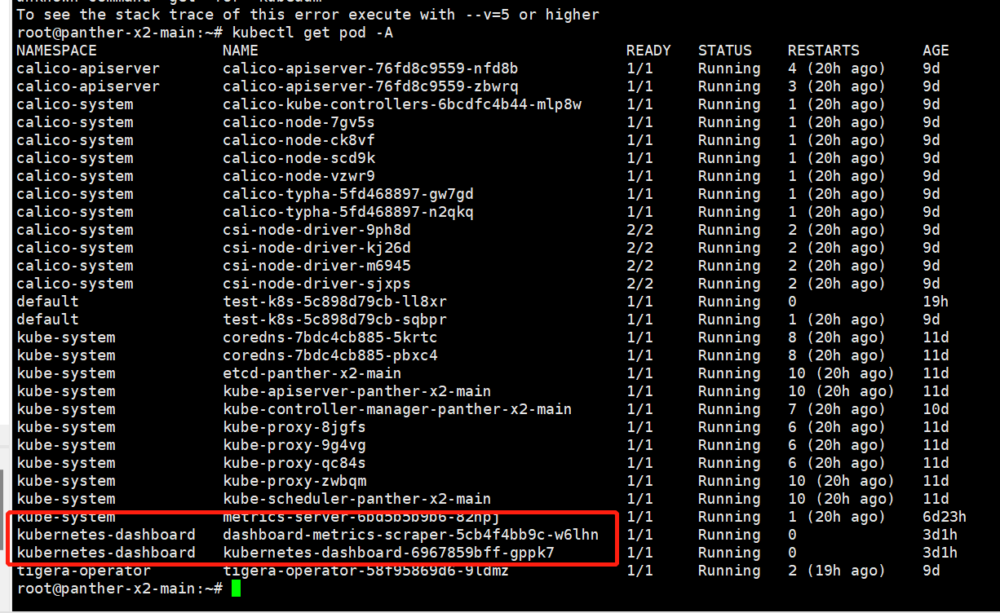

然后再根据官方文档使用 Kubernetes 的服务帐户机制创建新用户，授予该用户管理员权限并使用与该用户绑定的不记名令牌登录仪表板
```shell
vim admin-user.yaml


apiVersion: v1
kind: ServiceAccount
metadata:
  name: admin-user
  namespace: kubernetes-dashboard
```
```shell
vim cluster-admin.yaml

apiVersion: rbac.authorization.k8s.io/v1
kind: ClusterRoleBinding
metadata:
  name: admin-user
roleRef:
  apiGroup: rbac.authorization.k8s.io
  kind: ClusterRole
  name: cluster-admin
subjects:
- kind: ServiceAccount
  name: admin-user
  namespace: kubernetes-dashboard
```

然后再自己新建一个service 资源把dashboard的资源端口暴露出来：
```shell
root@panther-x2-main:~/dashboard# cat dashbord-service.yaml 
kind: Service
apiVersion: v1
metadata:
  labels:
    k8s-app: kubernetes-dashboard
  name: kubernetes-dashboard
  namespace: kubernetes-dashboard
spec:
  type: NodePort
  ports:
    - port: 443
      targetPort: 8443
      nodePort: 30002
  selector:
    k8s-app: kubernetes-dashboard

```
新建service资源：
```shell
 kubectl apply -f dashbord-service.yaml 
```

依次创建它们：
```shell
kubectl apply -f admin-user.yaml
kubectl apply -f cluster-admin.yaml 

```
获取不记名令牌:
```shell
kubectl -n kubernetes-dashboard create token admin-user

```
得到token:

然后访问dashboard的内网地址和service 端口，填入刚生成的token记得要加`https`
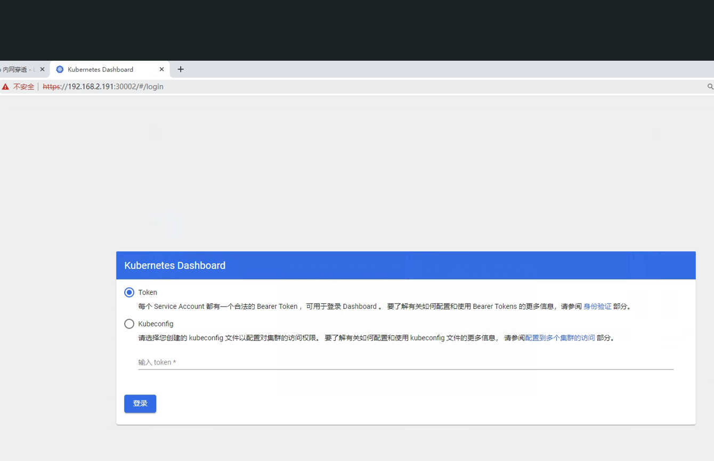
进来了：
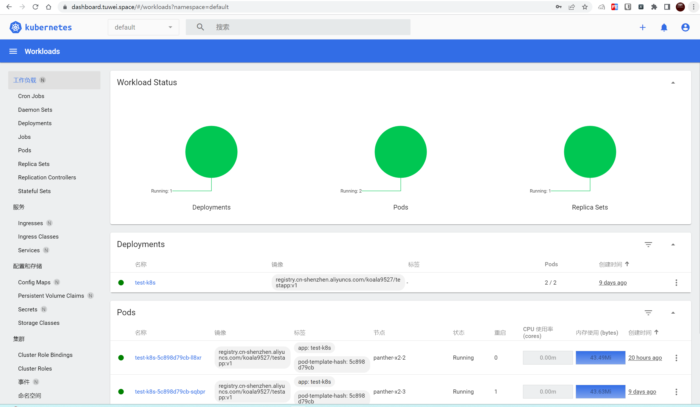
可以在这里里面创建新的资源：
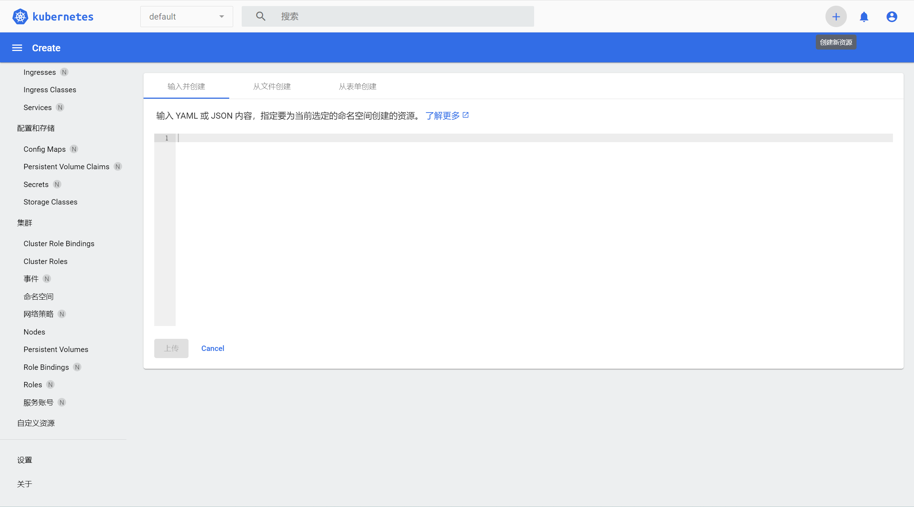
教程到此完结