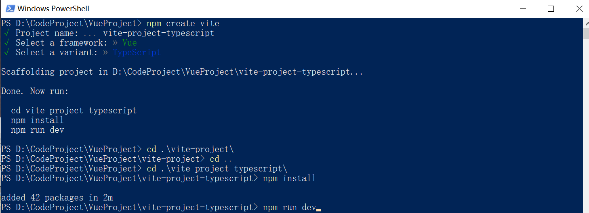
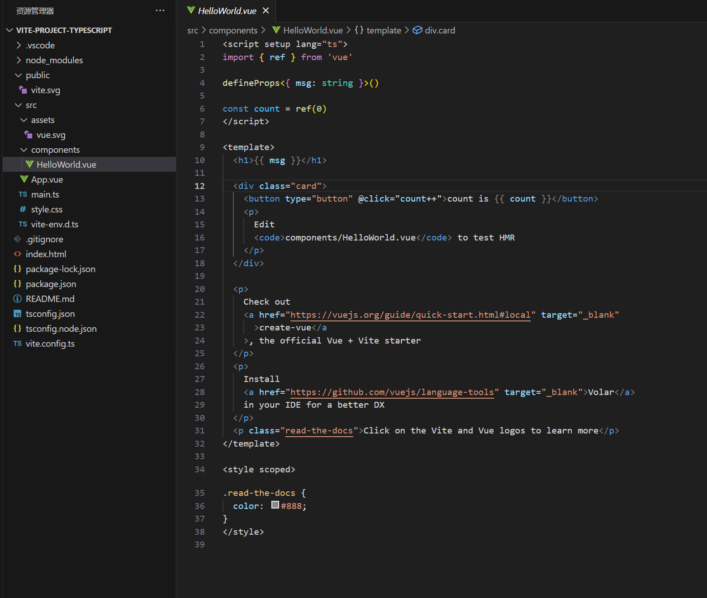

##  参考教程：


[VUE 官网](https://cn.vuejs.org/)  

[Vue3 入门指南与实战案例](https://vue3.chengpeiquan.com/)  

[BiliBili-尚硅谷Vue2.0+Vue3.0全套教程丨vuejs从入门到精通](https://www.bilibili.com/video/BV1Zy4y1K7SH/?vd_source=d81b0f1d86958760b70b7054b0ecfb07)  


## 前言
目的时学习UniApp ，需要前置学习一下Vue3,之前只了解了Vue2觉得落后太多了。很多概念不是很清楚，这里来基本整理一遍再开始实战

Vue的工程化，单一职责，高内聚，低耦合的特点

## 语法总结
首选创建一个官方推荐的脚手架：


使用 Vite 创建项目(主流)

```
npm create vite
```

```shell
PS D:\CodeProject\VueProject> npm create vite
Need to install the following packages:
  create-vite@4.4.1
Ok to proceed? (y) y
√ Project name: ... vite-project-typescript
√ Select a framework: » Vue
√ Select a variant: » TypeScript


```
设置项目名称：vite-project，vue类型项目，使用TypeScript 然后 cd 到vite-project-typescript, 安装依赖：
```typescript
npm install
```
启动项目：
```shell
npm run dev
```


访问http://127.0.0.1:5173/：


此时的目录结构：


有几个共识的文件统一目录：
* src： 源码
* src/main.ts: 入口文件
* src/view： 路由组件
* src/components：子组件目录
* src/route: 路由目录


# Composition API
Composition API 是Vue.js .30 新的编写组件的方式，旧的就是Option API

分别叫 组合式 API 和 选项式 API，组合就听着比较得复杂

## setup

组合式API 就必须使用setup 这个方法，当 Vue 组件创建时，setup 函数将作为组件的入口被调用。在 setup 函数中可以定义和返回在组件模板中需要的所有数据和方法。

```html
<template>
  <div>
    <label>
      <input type="radio" v-model="selectedOption" value="option1">
      Option 1
    </label>
    <label>
      <input type="radio" v-model="selectedOption" value="option2">
      Option 2
    </label>
    <p>You selected: {{ selectedOption }}</p>
  </div>
</template>

<script>
import { ref } from 'vue';

export default {
  name: 'SimpleOptionsComponent',
  setup() {
    const selectedOption = ref('option1');

    return {
      selectedOption
    };
  }
};
</script>
```

`export default` 是Vue2.js常见的导出组件的方式，但 Vue 3 建议使用命名导出来实现更灵活、清晰和强大的代码组织  
优化后：
```html
<template>
    <div>
      <label>
        <input type="radio" v-model="selectedOption" value="option1">
        Option 1
      </label>
      <label>
        <input type="radio" v-model="selectedOption" value="option2">
        Option 2
      </label>
      <p>You selected: {{ selectedOption }}</p>
    </div>
  </template>
  
  <script setup lang="ts">
  import { ref } from 'vue';
  
  const selectedOption = ref('option1');
  
  export { selectedOption };

  </script>
  
```
看起来有些简陋，还使用官方推荐的API 创建一个组件：
```html
<template>
  <div>
    <label>
      <input type="radio" v-model="selectedOption" value="option1">
      Option 1
    </label>
    <label>
      <input type="radio" v-model="selectedOption" value="option2">
      Option 2
    </label>
    <p>You selected: {{ selectedOption }}</p>
  </div>
</template>

<script>
import { defineComponent, ref } from 'vue';

export default defineComponent({
  setup() {
    const selectedOption = ref('option1');

    return {
      selectedOption
    };
  }
});
</script>

```
使用 defineComponent API 可以更清晰地表达组件的结构和选项，并且获得更好的类型推断和编辑器支持  
Vue3.js 所有的组合式API 每个生命走起函数都必须先导入才可以使用，并且所有的生命周期函数都需要放在setup中，后面会慢慢看到
Vue3.js的组件编程风格非常多官方还是推荐 `defineComponent` 这样定义一个组件 

## ref
其中`ref`是组合式API 中的一部分，`const selectedOption = ref('option1');`其中的 `selectedOption` 是一个可变的响应式的引用变量，这个组件被其他地方使用的时候，会让这个变量关联给其他地方使用达到响应式双向绑定的目的

`ref` 是一个响应式的API,可以用来定义所有类型的数据，包括Node节点和组件，上面个例子中使用ref创建了额一个响应式的数据对象，返回了一个可以最该数据变化的引用，在后面提供一种方式来修改`selectedOption`的值，也就是通过下面方式改变：
```javascript
selectedOption.value = 'option2';
// 或者

const { value } = selectedOption;
value = 'option2';
//或者
selectedOption.value.set('option2');
```
`ref`接受的是一个泛型的入参（<t>），上上个例子中使用了TS的自动推导，绑定了一个字符类型的参数，是一个最简单的绑定示例，ref 还可以绑定对象，数组，dom元素和子组件，功能强大，比较抽象，如果熟悉Vue2理解难度会小一些。

`ref`绑定dom 元素或子组件的时间必须在对应的js代码中使用red API 声明变量的名称，并且必须要return，入参类型名称也要定义好

最后注意使用`ref`声明的变量都会变成对象，任何Ref对象的值必须通过xxx.value 才能正确获取。

## reactive
这个　API 与ref非常相似，区别是reactive 只能绑定对象，数组，使用这个API好处就是对其绑定的数据进行操作非常人性化，可以直接操作

例子：
```html
<template>
    <div>
        <p>Count: {{ state.counter }}</p>
        <button @click="increment">Increment</button>
    </div>
</template>

<script lang="ts">
    import { defineComponent, reactive } from 'vue';

    interface State {
        counter: number;
    }

    export default defineComponent({
        setup() {
            // 创建一个响应式对象
            const state: State = reactive({
                counter: 0,
            });

            // 增加计数器的方法
            const increment = () => {
                state.counter++;
            };

            return {
                state,
                increment,
            };
        },
    });
</script>

```
注意使用这个API对数组操作重置的时候，不要强行改变数据的响应性，不能直接赋值空数组而是使数组长度设置为0。